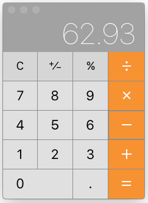
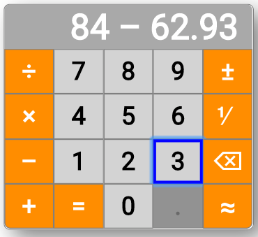

# calculator

Accessible calculator.

## Project Members

[Jonathan Pool](https://github.com/jrpool)

## General description

This is a single-page web application that implements an accessible calculator.

The application has evolved from an instructional exercise, whose stages are documented in the `history` directory.

Originally, the objective was to emulate the Macintosh OS X operating system’s “Calculator” application (basic view), but the objective evolved into making improvements in the usability and accessibility of that calculator.

The appearances of the two calculators in the same situation (after the user has entered “84 - 62.93”) are shown here:

Mac Calculator | This calculator
--- | ---
 | 

## Usage

Open the [web page](https://jrpool.github.io/calculator/) in a web browser, hover over buttons, click on buttons, navigate among buttons with the tab and shift-tab keys, operate focal buttons with the space or Enter or Return key, and press button-equivalent keyboard keys (described by tooltips appearing during hovering).

As illustrated above, the focal button is marked by a frame, and any disabled button is dimmed. Buttons become enabled and disabled as you use the calculator.

## Usability and accessibility

This calculator has some usability and accessibility features, partly missing from the Macintosh calculator. In the itemization below, features addressing recommendations of the Web Accessibility Guidelines Working Group are annotated with the numbers of the guidelines or success criteria in [Web Content Accessibility Guidelines 2.1](https://www.w3.org/TR/WCAG21/). Features addressing recommendations of the Accessible Rich Internet Applications Working Group are annotated with the numbers of paragraphs in [WAI-ARIA Authoring Practices 1.1](https://www.w3.org/TR/wai-aria-practices-1.1/), preceded by “ARIA”.

- Giving titles to buttons, so that you see button descriptions when hovering over buttons and assistive technologies can describe buttons’ purposes to you. This helps you predict the effect of operating any button. (3.2)
- Making each button title begin with the most distinctive word in the title, to minimize your reading or listening time.
- Making the buttons navigable with standard keyboard methods (`tab` and `shift-tab` keys). (2.1)
- Giving each button at least one keypress alternative. (2.1)
- Making the keypress alternatives predictable by making them identical to the button contents, or else specifying them in the button titles. (3.2)
- Choosing mnemonic keys for additional keypress alternatives. (ARIA 5.9.2)
- Making tab-key navigation traverse the buttons in a semantic order (`0`–`9`, then `.`, then calculate operator, then binary operators, then number modifiers) instead of an order based on the locations of the buttons. (2.4.3)
- Making it obvious which button currently has focus. (2.4.7)
- Visibly disabling buttons that, given the current state, have no effect. (3.2)
- Preventing loss of focus by moving focus from buttons being disabled to buttons remaining or becoming enabled. (2.4.7)
- Making button and result font sizes large enough to see if you have limited vision, but also enlargeable without loss of visibility or functionality. (1.4.4)
- Displaying the entire current state, so you don’t need to remember prior inputs that will determine future behavior.
- Permitting you to divide 1 by the current input or result number (i.e. convert the number to its reciprocal).
- Permitting you to shorten the current input or result number 1 digit at a time with rounding, so, for example, 3.438 gets shortened to 3.44.

Arguably, accessibility is impaired if the application is not accessible via all existing browsers, including browsers not executing JavaScript. No attempt has been made to achieve that kind of accessibility. However, all JavaScript in this application is intended to be supported by all widely used web browsers. It is known that Internet Explorer 11 fails to support many of the JavaScript features used here, but it currently [has only a 3% market share](http://gs.statcounter.com/). In line with [arguments by Alex Ewerlöf](https://medium.freecodecamp.org/you-might-not-need-to-transpile-your-javascript-4d5e0a438ca), no transpilation for backward compatibility has been undertaken.

## Future work

When keyboard alternatives for buttons are pressed in combination with modifier keys, the calculator acts on them, although it should disregard them. Correction of this deficiency is planned.

The addition of a clear-all operation is under consideration.

## Implementation

This section somewhat formally describes the concepts and rules of the implementation.

An _input_ is a single input that a user can perform. For each input, there is a button and there is at least 1 keypress that can perform it.

Each input has a _code_: a unique identifier of that input. For example, the input of the digit `1` has the code `num1`. The input of the reciprocal operator (the operator that divides 1 by a number) is `op1`.

At any time, the application is in some _state_. The state is the facts that the user can still do something about without restarting the application. The state is composed of 4 facts:

- _numString_: a string representing a number, or the empty string.
- _binaryOp_: the string `+`, `-`, `×`, or `÷`, or else undefined.
- _terms_: an array of 0, 1, or 2 elements. If it has a first element (`terms[0]`), that is a string representing a number. If it also has a second element (`terms[1]`), that is the string `+`, `-`, `×`, or `÷`.
- _inputs_: an array of data specifying, for each possible input, its button’s appearance type, whether it is enabled, and which input is the next in the navigation order.
- _round_: a Boolean value specifying whether rounding is in effect for truncations and calculations.

The format of any `numString` is exemplified by `⅟-1234.56e+15`. This represents the number you get when you multiply 1234.56 (the _multiplier_) by `e+15` (the _multiplicand_ and, in this example, equivalent to 10 to the 15th power, i.e. 1,000,000,000,000,000), then make the result negative (indicated by `-`, the _negator_), and then divide 1 by the result (indicated by `⅟`, the _reciprocalizer_). A numString (if not empty) must contain at least one digit, but otherwise it can contain or omit all the components shown here. The sign following `e` can be either `+` or `-`.

In a `numString` the multiplier cannot begin with '0' immediately followed by another digit, and also cannot contain “.” before its first digit. So, the application converts `0056` to `56`, and it converts `.5` to `0.5`.

A `term[0]` has the same format as a `numString`, except that:

- There must not be a reciprocalizer. The application calculates the reciprocal and displays that instead.
- There must not be a negator if the multiplier is `0`. The application deletes the negator in that case.
- There must not be trailing `0`s in the multiplier after a decimal point.
- There must not be a decimal point in the multiplier unless there is at least 1 digit after it.

Numbers in scientific notation (i.e. with `e`) cannot be directly input. They arise automatically in very large or very small results.

Whether any input can be performed depends on the values of `numString`, `binaryOp`, and `terms`. For example, if `numString` and `terms` are empty, the only performable inputs are digits and the decimal point. If you then enter a digit, 7 more inputs (such as `+`) become performable. At any time, only the performable inputs are enabled; the other inputs are disabled. When an input is disabled, its button and its keypresses have no effect.

The state is always displayed in the calculator. The `terms` elements and the `numString` or `binaryOp` are concatenated and displayed at the top. An example is `-456.78 ÷ 31`, where `31` is the `numString`. The `inputs` are displayed as buttons: bright if enabled, and dim if disabled.

The `op^` input, performed with the `±` button or the`` ` ``key, toggles the presence of a negator in `numString`.

The `op1` input, performed with the `⅟` button or the `\` key, toggles the presence of a reciprocalizer in the `numString`.

The `op!` input, performed with the `⌫` button or the `Backspace` key, truncates the `numString` incrementally or deletes the `binaryOp`. If doing that eliminates a `binaryOp` or the only remaining digit of a `numString`, the change in state that would have occurred upon the inputting of that character is reversed. For example, if the `terms` are `123` and `+` and there is a `numString` of `5`, inputting `op!` deletes the `numString` and converts the `+` from `terms[1] to `binaryOp`. Any format changes enforced on a `numString` when it was converted to `terms[0]`, however, are not reversed if a deletion returns it from `terms[0]` to `numString`.

The `op=` input, performed with the `=` button or the `=` or `Enter` key, performs the calculation, makes the result the `numString`, and empties the `terms`.

The `op~` input, performed with the `≈` button or the `~` key, truncates the `numString` by one decimal digit, rounding and minimalizing the result. Minimalization includes deletion of any trailing post-decimal-point zero digits and deletion of the decimal point if nothing follows it.

A `binaryOp` input, performed with any of the buttons in the left-most column or with the `+` (plus), `-` (minus), `*` (times), or `/` or `÷` (divided by) key, has an effect that depends on the state.

- If there is no term, it converts the `numString` to a `term` and then makes itself the `binaryOp`.
- If there are 1 term and a `binaryOp`, it replaces the `binaryOp` with itself.
- If there are 2 terms and a `numString`, it performs the calculation with those 3 arguments, replaces the terms with the result as 1 term, and makes itself the `binaryOp`.

A digit or decimal-point input has an effect that depends on the state.

- If there is a `binaryOp`, it converts the `binaryOp` to `terms[1]` and makes `0.` the initial value of `numString`.
- If there is a `numString`, it appends itself to the `numString`.

Notwithstanding any of the rules above, the calculator disables the input of any digit if the aggregate length of `numString` and `terms[0]` reaches 40.
