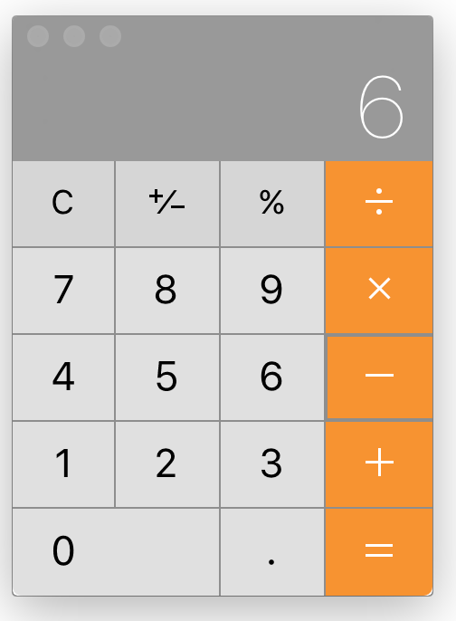
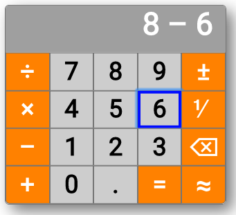

# calculator

Web application implementing a calculator.

## Project Members

[Jonathan Pool](https://github.com/jrpool)

## Discussion

### General

This application demonstrates the use of the fundamental web languages, HTML, CSS, and JavaScript, to create an application that runs entirely inside a web browser.

The demonstration takes the form of an arithmetic calculator.

The application fulfilled a variation on the requirements of the “Mac Calculator Clone” exercise of the “JavaScript in the Browser” module in Phase 2 of the [Learners Guild][lg] curriculum, as it existed in mid-2017. The exercise required cloning the functionality of the Macintosh OS X operating system’s “Calculator” application (basic view), but this application modifies that functionality. The intent is to make a calculator with superior functionality and a more intuitive interface.

The appearances of the two calculators in the same situation (after the user has entered “8 - 6”) are shown here:

Mac Calculator | This calculator
--- | ---
 | 

The exercise built the application in 3 stages.

Stage 1 constructed a clone of the appearance and aesthetic response of the Calculator application of the Macintosh OS X operating system. The calculator responded to hovering and to clicks by darkening the target elements. Its appearance and response were produced by HTML and CSS code. Stage 1 of the calculator did not calculate.

Stage 2 added JavaScript code to make the calculator perform calculating operations in response to user actions. Stage 2 also changed the layout of the calculator and the set of its buttons. It also changed the appearance of the buttons, making them dim and inert when the state of the calculator made them ineligible for use. It is documented in its own [README file](README2.md). There is a [more detailed discussion](http://stulta.com/forumo/archives/2089) of stage 2 and its motivation.

Stage 3 added _accessibility_ features to the calculator. These are features that serve the purpose of making the application usable, or more easily usable, by users with a variety of sensory and motor skills (including users with disabilities and age-related limitations). Features addressing recommendations of the Web Accessibility Guidelines Working Group are annotated with the numbers of the guidelines or success criteria in [Web Content Accessibility Guidelines 2.1](https://www.w3.org/TR/WCAG21/). Features addressing recommendations of the Accessible Rich Internet Applications Working Group are annotated with the numbers of paragraphs in [WAI-ARIA Authoring Practices 1.1](https://www.w3.org/TR/wai-aria-practices-1.1/), preceded by “ARIA”. The accessibility features in this stage (and some in stage 2) include:

- Giving titles to buttons, so that users see button descriptions when hovering over buttons and so that assistive technologies can describe buttons’ purposes to users. This helps users predict the effect of operating any button. (3.2)
- Making each button title begin with the most distinctive word in the title, to minimize reading or listening time.
- Making the buttons navigable with standard keyboard methods (`tab` and `shift-tab` keys). (2.1)
- Giving each button at least one keypress alternative. (2.1)
- Making the keypress alternatives predictable by making them identical to the button contents, or else specifying them in the button titles. (3.2)
- Choosing mnemonic keys for additional keypress alternatives. (ARIA 5.9.2)
- Making tab-key navigation traverse the buttons in an intrinsic order (`0`–`9`, then `.`, then binary operators, then number modifiers, then calculate operator, then rounding switch) instead of an order based on the locations of the buttons. (2.4.3)
- Making it obvious which button currently has focus. (2.4.7)
- Disabling buttons that, given the current state, have no effect. (3.2)
- Preventing loss of focus my moving focus from buttons being disabled to buttons remaining or becoming enabled. (2.4.7)
- Making button and result font size large enough for users with limited vision, but also enlargeable without loss of visibility or functionality. (1.4.4)
- Making rounding less confusing by changing the stage-2 rounding **operator** to a rounding **mode switch** in stage 3. The operator either calculated or truncated, and in some states it could have done either but did only one. As a mode switch it lets the user turn rounding on or off for both calculations and truncations. (3.2)
- Making calculation’s and truncation’s titles vary, depending on whether rounding is on and off, to clarify what each operation will do. (3.2)
- Displaying the entire state, so user does not need to remember prior inputs that will determine future behavior.

### Implementation logic

As of stage 3, the implementation is based on the following concepts and rules.

An _input_ is a single input that a user can perform. For each input, there is a button and there is at least 1 keypress that can perform it.

Each input has a _code_: a unique identifier of that input. For example, the input of the digit `1` has the code `num1`. The input of the reciprocal operator (the operator that divides 1 by a number) is `op1`.

At any time, the application is in some _state_. The state is the facts that the user can still do something about without restarting the application. The state is composed of 4 facts:

- _numString_: a string representing a number, or the empty string.
- _binaryOp_: the string `+`, `-`, `×`, or `÷`, or else undefined.
- _terms_: an array of 0, 1, or 2 elements. If it has a first element (`terms[0]`), that is a string representing a number. If it also has a second element (`terms[1]`), that is the string `+`, `-`, `×`, or `÷`.
- _inputs_: an array of data specifying, for each possible input, its button’s appearance type, whether it is enabled, and which input is the next in the navigation order.
- _round_: a Boolean value specifying whether rounding is in effect for truncations and calculations.

The format of any `numString` is exemplified by `⅟-1234.56e+15`. This represents the number you get when you multiply 1234.56 (the _multiplier_) by `e+15` (the _multiplicand_ and, in this example, equivalent to 10 to the 15th power, i.e. 1,000,000,000,000,000), then make the result negative (indicated by `-`, the _negator_), and then divide 1 by the result (indicated by `⅟`, the _reciprocalizer_). A numString (if not empty) must contain at least one digit, but otherwise it can contain or omit all the components shown here. The sign following `e` can be either `+` or `-`.

In a `numString` the multiplier cannot begin with '0' immediately followed by another digit, and also cannot contain “.” before its first digit. So, the application converts `0056` to `56`, and it converts `.5` to `0.5`.

A `term[0]` has the same format as a `numString`, except that:

- There must not be a reciprocalizer. The application calculates the reciprocal and displays that instead.
- There must not be a negator if the multiplier is `0`. The application deletes the negator in that case.
- There must not be trailing `0`s in the multiplier after a decimal point.
- There must not be a decimal point in the multiplier unless there is at least 1 digit after it.

Numbers in scientific notation (i.e. with `e`) cannot be directly input. They arise automatically in very large or very small results.

Whether any input can be performed depends on the values of `numString`, `binaryOp`, and `terms`. For example, if `numString` and `terms` are empty, the only performable inputs are digits and the decimal point. If you then enter a digit, 7 more inputs (such as `+`) become performable. At any time, only the performable inputs are enabled; the other inputs are disabled. When an input is disabled, its button and its keypresses have no effect.

The state is always displayed in the calculator. The `terms` elements and the `numString` or `binaryOp` are concatenated and displayed at the top. An example is `-456.78 ÷ 31`, where `31` is the `numString`. The `inputs` are displayed as buttons: bright if enabled, and dim if disabled.

The `op^` input, performed with the `±` button or the`` ` ``key, toggles the presence of a negator in `numString`.

The `op1` input, performed with the `⅟` button or the `\` key, toggles the presence of a reciprocalizer in the `numString`.

The `op!` input, performed with the `⌫` button or the `Backspace`, `Escape`, or `Clear` key, truncates the `numString` incrementally or deletes the `binaryOp`. If doing that eliminates a `binaryOp` or the only remaining digit of a `numString`, the change in state that would have occurred upon the inputting of that character is reversed. For example, if the `terms` are `123` and `+` and there is a `numString` of `5`, inputting `op!` deletes the `numString` and converts the `+` from `terms[1] to `binaryOp`. Any format changes enforced on a `numString` when it was converted to `terms[0]`, however, are not reversed if a deletion returns it from `terms[0]` to `numString`.

The `op=` input, performed with the `=` button or the `=` or `Enter` key, performs the calculation, makes the result the `numString`, and empties the `terms`.

The `op~` input, performed with the `≈` button or the `~` key, switches rounding on or off. Rounding is initially on when the application is loaded. Whether rounding is on or off affects both calculation and truncation.

- Rounding makes calculation round the result when it differs only slightly from a rounder number. For example, with rounding off, a calculation of `8.1 – 6` (incorrectly) produces `2.0999999999999996` (an artifact of binary number representation). With rounding on, it produces `2.1`.
- Rounding makes truncation perform rounding, too. For example, with rounding off, truncating `4.8` produces `4.`. With rounding on, it produces `5`.

A `binaryOp` input, performed with any of the buttons in the left-most column or with the `+` (plus), `-` (minus), `*` (times), or `/` or `÷` (divided by) key, has an effect that depends on the state.

- If there is no term, it converts the `numString` to a `term` and then makes itself the `binaryOp`.
- If there are 1 term and a `binaryOp`, it replaces the `binaryOp` with itself.
- If there are 2 terms and a `numString`, it performs the calculation with those 3 arguments, replaces the terms with the result as 1 term, and makes itself the `binaryOp`.

A digit or decimal-point input has an effect that depends on the state.

- If there is a `binaryOp`, it converts the `binaryOp` to `terms[1]` and makes `0.` the initial value of `numString`.
- If there is a `numString`, it appends itself to the `numString`.

Notwithstanding any of the rules above, the calculator disables the input of any digit if the aggregate length of `numString` and `terms[0]` reaches 40.

The above rules, while not intuitive as presented, are intended to produce a calculator that does what the user’s intuition anticipates.

### Implementation

As required by the terms of the exercise, all JavaScript in this application is intended to conform to the ECMAScript 5 standard, omitting any features that were introduced in ECMAScript 2015. The intent is to make the application compatible with browsers that have not been updated to support ECMAScript 2015, as well as those that have been.

## Usage and Examples

Stage 1: To experience the product of stage 1, open the [stage-1 web page](https://jrpool.github.io/calculator/stage1/) in a web browser, hover over buttons, and click on buttons.

Stage 2: To experience the product of stage 2, open the [stage-2 web page](https://jrpool.github.io/calculator/stage2/) in a web browser, hover over buttons, and click on buttons.

[lg]: https://www.learnersguild.org
